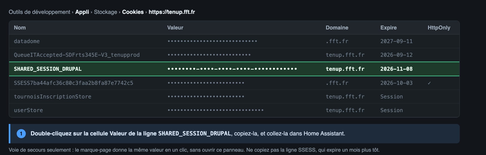

# Ten'Up pour Home Assistant

Voir les courts libres de votre club de tennis sur [Ten'Up](https://tenup.fft.fr) (FFT) et réserver ou annuler un court depuis Home Assistant.

> 🇬🇧 [Read in English](README.md)

## Ce que vous obtenez

- **Capteurs** : créneaux libres aujourd'hui, créneaux libres sur les prochains jours, prochain créneau libre, prochaine réservation, nombre de réservations.
- **Calendrier** : vos réservations au club.
- **Services** : `tenup.book` et `tenup.cancel`.
- **Commande websocket** `tenup/planning` avec la grille complète (courts x créneaux x jours) pour une carte dédiée.

L'intégration lit le tableau de réservation des adhérents (« Réserver dans mon club »), pas la location horaire payante.

## Prérequis

- Un compte Ten'Up adhérent du club (licence avec une formule de réservation).
- Home Assistant 2024.12 ou plus récent.

## Installation

1. HACS > Intégrations > trois points > Dépôts personnalisés > ajouter `https://github.com/ADNPolymerase/ha-tenup-resa` (catégorie Intégration).
2. Installer **Ten'Up**, redémarrer Home Assistant.
3. Paramètres > Appareils et services > Ajouter une intégration > **Ten'Up**.

## Configuration

1. **Votre club** : tapez son nom et choisissez-le dans la liste (ou collez son code Ten'Up à 8 chiffres, visible dans l'URL du tableau de réservation).
2. **Votre session** : Ten'Up n'autorise pas la connexion par mot de passe depuis un outil tiers (la page de connexion est protégée contre les connexions automatisées). L'intégration utilise donc la session de votre navigateur :
   **Le plus simple, sans outils de développement.** Le formulaire de Home Assistant affiche directement la ligne ci-dessous : créez un favori dont l'adresse est cette ligne. Home Assistant sert aussi une page d'installation où le marque-page se **glisse** dans la barre de favoris, à l'adresse `/api/tenup/bookmarklet` de votre instance (par exemple `http://homeassistant.local:8123/api/tenup/bookmarklet`), à ouvrir dans un onglet. Connectez-vous ensuite sur tenup.fft.fr, **ouvrez « Réserver dans mon club »** (le marque-page ne fonctionne que depuis l'espace de réservation, pas depuis l'accueil), puis cliquez dessus : il met la session dans votre presse-papier, vous n'avez plus qu'à la coller dans Home Assistant. Si le navigateur refuse le presse-papier, il affiche la valeur à copier.

   ```javascript
   javascript:(function(){var m=document.cookie.match(/(?:^|;\s*)SHARED_SESSION_DRUPAL=([^;]+)/);if(!m){alert("Connectez-vous d'abord sur tenup.fft.fr, puis recliquez.");return}var v="SHARED_SESSION_DRUPAL="+m[1];function f(){prompt("Collez ceci dans Home Assistant:",v)}try{navigator.clipboard.writeText(v).then(function(){alert("Session copiee. Collez-la dans Home Assistant (Ctrl+V ou Cmd+V).")},f)}catch(e){f()}})()
   ```

   Ce marque-page lit `SHARED_SESSION_DRUPAL`, le cookie qui relie le site à son espace de réservation. Il n'est pas `HttpOnly`, donc un script de page peut le lire, et il vit environ **deux mois**. Home Assistant s'en sert pour ouvrir une session quand il en a besoin, ce qui espace d'autant les recollages.

   **Sans marque-page**, la valeur se lit dans les outils de développement (F12) > onglet Appli > Cookies > `https://tenup.fft.fr` :

   

   Au choix aussi : onglet Réseau > clic droit sur une ligne > Copier > **Copier en tant que cURL**, et collez le tout. L'intégration ne retient que le cookie utile : adresses, en-têtes et autres cookies sont ignorés et ne sont jamais enregistrés.

Quand la session expire, Home Assistant affiche une réparation qui demande un cookie frais. Aucun mot de passe n'est jamais stocké.

Options : nombre de jours à charger (7 par défaut, l'horizon du club) et intervalle de rafraîchissement (15 minutes par défaut).

## Services

```yaml
service: tenup.book
data:
  court_id: "21100"          # voir les attributs des capteurs ou la commande planning
  start: "2026-09-10 21:00:00"
```

```yaml
service: tenup.cancel
data:
  reservation_id: "165841846"   # ou court_id + start
```

Les deux services renvoient une réponse (`response_variable`) et lèvent une erreur lisible quand Ten'Up refuse (par exemple la règle du club sur les réservations simultanées).

Seuls les créneaux à un joueur sont réservables pour l'instant. Les courts qui demandent deux joueurs (partenaire) renvoient une erreur explicite.

## À savoir

- Ten'Up annule une réservation sans demander de confirmation. Le service fait exactement cela : prévoyez une confirmation dans vos automatisations ou vos cartes.
- L'API publique de recherche sert à trouver le club, tout le reste passe par votre session.

## Support

Bugs et idées : [GitHub issues](https://github.com/ADNPolymerase/ha-tenup-resa/issues).

---

Ten'Up et le logo Ten'Up sont des marques de la Fédération Française de Tennis. Ce projet non officiel n'est ni affilié à la FFT ni approuvé par elle.
