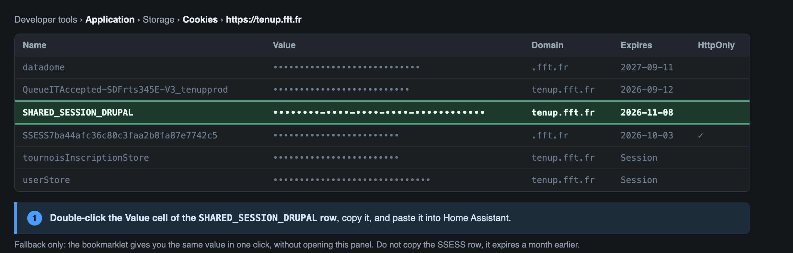

# Ten'Up for Home Assistant

[](https://hacs.xyz/docs/faq/custom_repositories/)
[](https://github.com/ADNPolymerase/ha-tenup-resa/releases)
[](https://github.com/ADNPolymerase/ha-tenup-resa/actions/workflows/hassfest.yml)
[](LICENSE)

See the free courts of your tennis club on [Ten'Up](https://tenup.fft.fr) (French Tennis Federation) and book or cancel a court from Home Assistant.

> 🇫🇷 [Lire en français](README.fr.md)

## What you get

- **Sensors**: free slots today, free slots over the coming days, next free slot, next reservation, number of reservations.
- **Calendar**: your reservations at the club.
- **Services**: `tenup.book` and `tenup.cancel`.
- **Websocket command** `tenup/planning` with the full grid (courts x slots x days) for a companion card.

The integration reads the member reservation grid of your club (`Réserver dans mon club`), not the paid hourly rental.

## Requirements

- A Ten'Up account that is a member of the club (a licence with a booking formula).
- Home Assistant 2024.12 or newer.

## Installation

1. HACS > Integrations > three dots > Custom repositories > add `https://github.com/ADNPolymerase/ha-tenup-resa` (category Integration).
2. Install **Ten'Up**, restart Home Assistant.
3. Settings > Devices and services > Add integration > **Ten'Up**.

## Configuration

1. **Your club**: type its name, pick it in the list (or paste its 8-digit Ten'Up code, visible in the URL of the reservation grid).
2. **Your session**: Ten'Up does not allow logging in with a password from a third-party tool (the login page is protected against automated logins), so the integration works with the session of your browser:
   **The easy way, no developer tools.** The Home Assistant form shows the line below directly: create a bookmark whose address is that line. Home Assistant also serves an install page where the bookmarklet can be **dragged** to the bookmarks bar, at `/api/tenup/bookmarklet` on your instance (for example `http://homeassistant.local:8123/api/tenup/bookmarklet`), to open in a tab. Then log in on tenup.fft.fr, **open "Book at my club"** (the bookmarklet only works from inside the reservation area, not from the home page), and click it: it puts the session in your clipboard, you only have to paste it into Home Assistant. If the browser refuses clipboard access, it shows the value to copy.

   ```javascript
   javascript:(function(){var m=document.cookie.match(/(?:^|;\s*)SHARED_SESSION_DRUPAL=([^;]+)/);if(!m){alert("Log in on tenup.fft.fr first, then click again.");return}var v="SHARED_SESSION_DRUPAL="+m[1];function f(){prompt("Paste this into Home Assistant:",v)}try{navigator.clipboard.writeText(v).then(function(){alert("Session copied. Paste it into Home Assistant (Ctrl+V or Cmd+V).")},f)}catch(e){f()}})()
   ```

   The bookmarklet reads `SHARED_SESSION_DRUPAL`, the cookie that bridges the site and its reservation area. It is not `HttpOnly`, so a page script can read it, and it lives for about **two months**. Home Assistant uses it to open a session whenever it needs one, so you re-paste far less often.

   **Without the bookmarklet**, the value is in the developer tools (F12) > Application tab > Cookies > `https://tenup.fft.fr`:

   

   Or: Network tab > right-click a row > Copy > **Copy as cURL**, and paste the whole thing. The integration keeps only the useful cookie: URLs, headers and other cookies are ignored and never stored.

When the session expires, Home Assistant raises a repair asking for a fresh cookie. No password is ever stored.

Options: number of days to fetch (default 7, the club horizon) and refresh interval (default 15 minutes).

## Services

```yaml
service: tenup.book
data:
  court_id: "21100"          # see the attributes of the sensors or the planning command
  start: "2026-09-10 21:00:00"
```

```yaml
service: tenup.cancel
data:
  reservation_id: "165841846"   # or court_id + start
```

Both services return a response (`response_variable`) and raise a readable error when Ten'Up refuses (for example the club rule on simultaneous reservations).

Only slots that require a single player are bookable for now. Courts that require two players (partner) are reported with an explicit error.

## Notes

- Ten'Up cancels a reservation without asking for confirmation. The service does exactly that, so wire a confirmation in your automations or dashboards.
- The public search API is used to find the club, everything else goes through your session.

## Support

Issues and ideas: [GitHub issues](https://github.com/ADNPolymerase/ha-tenup-resa/issues).

---

Ten'Up and the Ten'Up logo are trademarks of the Fédération Française de Tennis. This is an unofficial project, not affiliated with or endorsed by the FFT.
